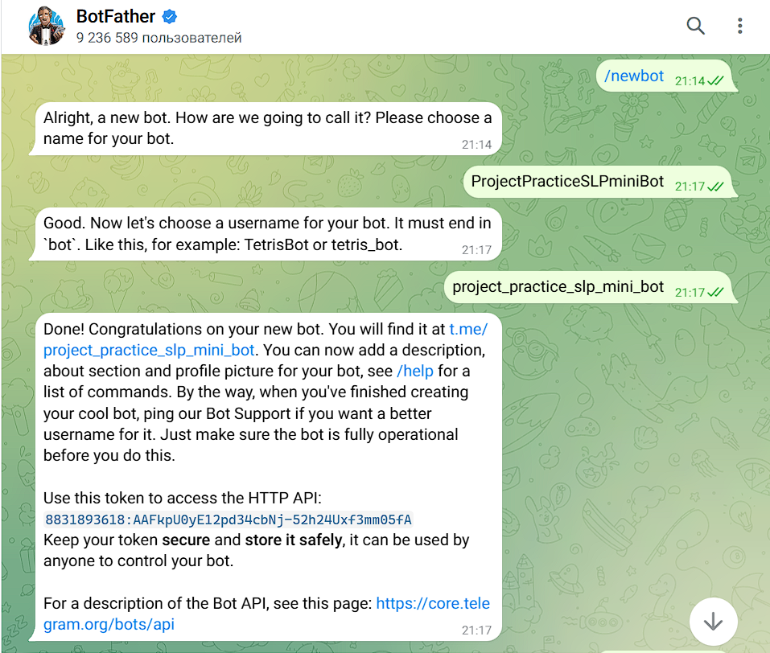
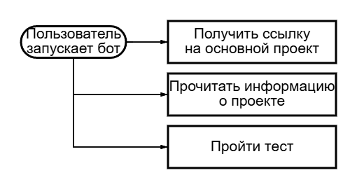
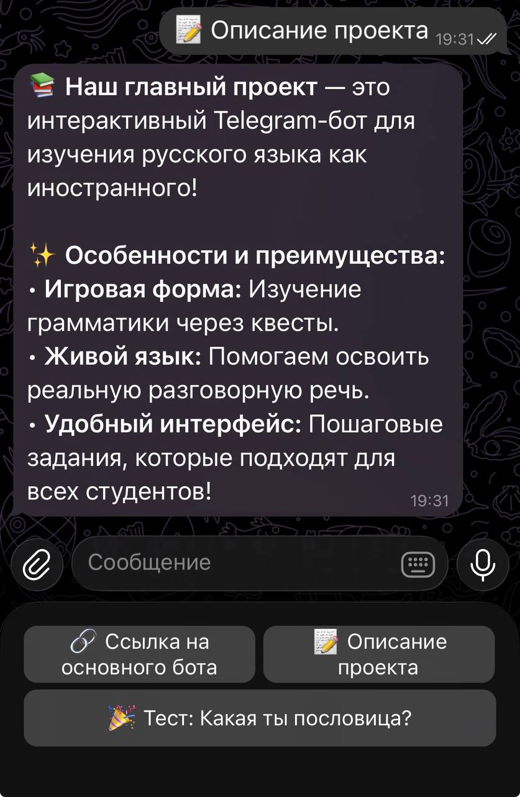
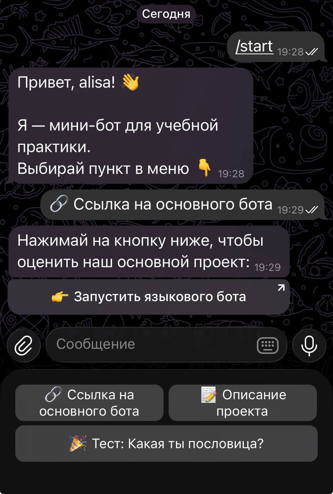
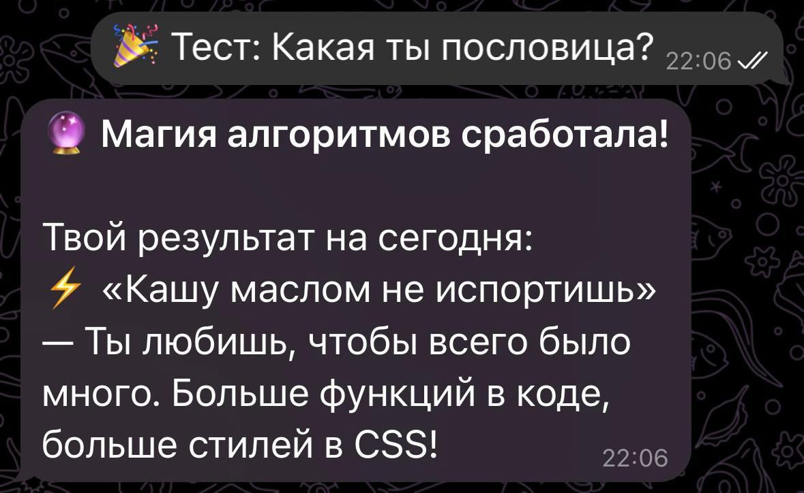
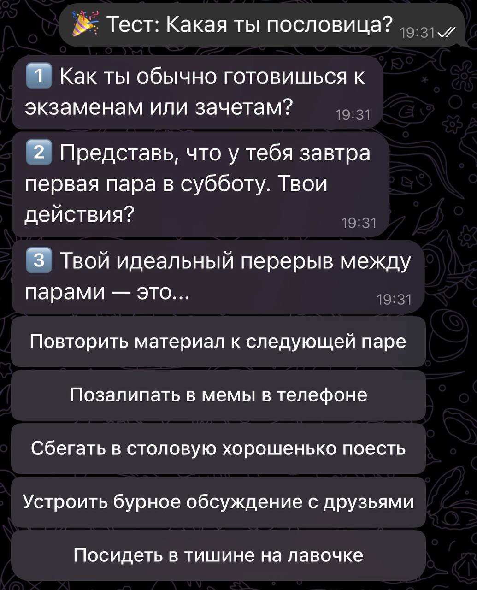
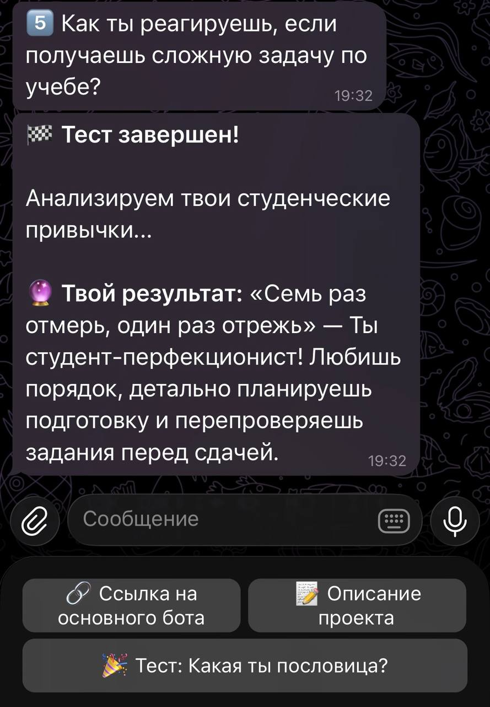

# ОТЧЕТ И ТЕХНИЧЕСКОЕ РУКОВОДСТВО: Вариативный Telegram-бот
## Часть 1. Исследование предметной области и создание технологии
### Цель исследования:
Изучить процесс создания Telegram-бота с нуля и разработать функциональный вариативный модуль, интегрируемый в основную экосистему проекта «Говори. Учись. Играй».
### Последовательность действий по исследованию:
- Анализ проблемы: Иностранные студенты нуждаются в психологической разгрузке и социокультурной адаптации. Оптимальный формат — знакомство с русским менталитетом через пословицы.
- Формирование ТЗ: Бот должен уметь выдавать пользователю случайную пословицу для изучения, предоставлять справочную информацию о проекте и содержать прямую ссылку-переход на основной обучающий бот команды.
- Выбор стека: Python 3 и библиотека pyTelegramBotAPI (Telebot).
- Проектирование: Создание базовой архитектуры меню с использованием InlineKeyboardMarkup для навигации.
- Практическая реализация и тестирование: Написание скрипта, подключение генератора случайных чисел (random.choice) для выдачи контента и деплой.

## Часть 2. Техническое руководство для начинающих
В этом руководстве я создам бота, который знакомит пользователей с проектом и выдает случайные русские пословицы, и распишу этапы его разработки.

### Шаг 1. Регистрация бота
- Откройте Telegram, найдите @BotFather и отправьте команду /newbot.
- Задайте юзернейм (у меня: project_practice_slp_mini_bot).
- Скопируйте полученный HTTP API Token.



### Шаг 2. Подготовка окружения
Откройте терминал на вашем компьютере и установите библиотеку:
pip install pyTelegramBotAPI

### Шаг 3. Техническое задание и структура
Мой бот будет иметь стартовое меню из трех кнопок:
| ФНазвание кнопки | Тип действия | Ожидаемый результат |
|-|-|-|
| Случайная пословица | callback_data |	Вывод случайной пословицы из встроенного списка |
| О проекте | callback_data | Текстовое описание проекта «Говори. Учись. Играй» |
| Основной бот | url | Редирект (переход) в главный Telegram-бот команды |



### Шаг 4. Написание кода базовой версии
Создайте файл main.py и напишите базовую логику. Я использую модуль random для выбора случайного элемента из списка.
```python
import telebot
from telebot import types
import random

TOKEN = '8831893618:AAE6xtPxfLUzP1H9l42Qdnx7dq24IZDt000'
bot = telebot.TeleBot(TOKEN)

#Варианты ответов для теста
PROVERBS = [
    "«Семь раз отмерь, один раз отрежь» — Ты человек-перфекционист. Перепроверяешь код по 10 раз, прежде чем сделать коммит!",
    "«Работа не волк, в лес не убежит» — Твой девиз. Прокрастинация — второе имя, но перед дедлайном ты включаешь суперскорость.",
    "«Без труда не выловишь и рыбку из пруда» — Ты истинный трудяга. Пишешь код сама, сдаешь лабы вовремя и спасаешь команду.",
    "«Кашу маслом не испортишь» — Ты любишь, чтобы всего было много. Больше функций в коде, больше стилей в CSS!",
    "«Тише едешь — дальше будешь» — Твой подход к учебе. Никуда не спешишь, разбираешься во всем основательно и без паники."
]

# Команда /start
@bot.message_handler(commands=['start'])
def start_message(message):
    # Создаем главное меню (кнопки внизу экрана)
    markup = types.ReplyKeyboardMarkup(resize_keyboard=True)
    btn_link = types.KeyboardButton("🔗 Ссылка на основного бота")
    btn_info = types.KeyboardButton("📝 Описание проекта")
    btn_fun = types.KeyboardButton("🎉 Тест: Какая ты пословица?")
    
    # Распределяем кнопки: первые две в один ряд, третью — ниже
    markup.add(btn_link, btn_info)
    markup.add(btn_fun)
    
    welcome_text = (
        f"Привет, {message.from_user.first_name}! 👋\n\n"
        "Я — мини-бот, созданный в рамках учебной практики.\n"
        "Здесь ты можешь узнать всё о нашем проекте для изучения русского языка и немного поднять себе настроение! "
        "Выбирай пункт в меню 👇"
    )
    bot.send_message(message.chat.id, welcome_text, reply_markup=markup)

# Обработка нажатий на кнопки
@bot.message_handler(content_types=['text'])
def handle_menu(message):
    if message.text == "🔗 Ссылка на основного бота":
        # Делаем красивую inline-кнопку, которая открывается как ссылка
        inline_markup = types.InlineKeyboardMarkup()
        inline_btn = types.InlineKeyboardButton("👉 Запустить языкового бота", url="https://t.me/SpeakLearnPlayBot")
        inline_markup.add(inline_btn)
        
        bot.send_message(
            message.chat.id, 
            "Над этим проектом наша команда трудилась очень долго! Нажимай на кнопку ниже, чтобы оценить результат:", 
            reply_markup=inline_markup
        )
        
    elif message.text == "📝 Описание проекта":
        description = (
            "📚 *Наш главный проект* — это интерактивный Telegram-бот для изучения русского языка как иностранного!\n\n"
            "✨ *Особенности и преимущества:*\n"
            "• *Игровая форма:* Изучение грамматики через увлекательные текстовые игры и квесты.\n"
            "• *Живой язык:* Помогаем иностранцам освоить не скучные правила из учебников, а реальную разговорную речь.\n"
            "• *Удобный интерфейс:* Пошаговые задания, которые не пугают обилием теории.\n\n"
            "Этот проект идеально сочетает в себе современные технологии и прикладную лингвистику!"
        )
        bot.send_message(message.chat.id, description, parse_mode="Markdown")
        
    elif message.text == "🎉 Тест: Какая ты пословица?":
        # Случайный выбор из списка пословиц
        random_proverb = random.choice(PROVERBS)
        bot.send_message(
            message.chat.id, 
            f"🔮 *Магия алгоритмов сработала!*\n\nТвой результат на сегодня:\n⚡️ {random_proverb}",
            parse_mode="Markdown"
        )
    else:
        bot.send_message(message.chat.id, "Ой, я знаю только команды с кнопочек. Попробуй нажать на одну из них! 🤖")

# Запуск постоянного опроса сервера Telegram
if __name__ == '__main__':
    print("Бот успешно запущен...")
    bot.infinity_polling()
```

### Скриншоты работы бота:




## Часть 3. Интеграция с Git-репозиторием
Все наработки должны быть сохранены в общем проекте.

### Алгоритм работы:
- Откройте терминал в папке с ботом и выполните: git init.
- Добавьте файлы: git add main.py.
- Сохраните версию: git commit -m "Создана базовая версия бота: рандом и навигация".
- Отправьте в сеть: git push origin main.

## Часть 4. Модификация проекта
### Описание модификации:
В ходе изучения алгоритмизации и развития проекта в течение года было принято решение превратить примитивную механику «выдачи случайного текста» в полноценный интерактивный квиз.

### Алгоритм работы:
- Сбор данных: Бот задает 5 вопросов, связанных с учебными привычками студента.
- Обработка: Внедрена логика поиска "наиболее частого ответа" (моды) среди всех выбранных вариантов.
- Результат: Это позволило выдавать пользователю индивидуализированную пословицу на основании его ответов, что значительно повысило интерес аудитории к боту.

### Итоговый код бота:
```python
import telebot
from telebot import types

TOKEN = '8831893618:AAE6xtPxfLUzP1H9l42Qdnx7dq24IZDt000' 
bot = telebot.TeleBot(TOKEN)

# Вопросы и варианты ответа на них для квиза
QUESTIONS = [
    {
        "text": "1️⃣ Как ты обычно готовишься к экзаменам или зачетам?",
        "answers": [
            ("Учу всё заранее", "1"),
            ("В самую последнюю ночь", "2"),
            ("Учу усердно каждый день", "3"),
            ("Надеюсь на автомат и удачу", "4"),
            ("Учу спокойно и не торопясь", "5")
        ]
    },
    {
        "text": "2️⃣ Представь, что у тебя завтра первая пара в субботу. Твои действия?",
        "answers": [
            ("Лягу спать пораньше", "1"),
            ("Опять просплю её", "2"),
            ("Приду вовремя в любом случае", "3"),
            ("Пойду гулять, а там как пойдет", "4"),
            ("Поставлю 5 будильников", "5")
        ]
    },
    {
        "text": "3️⃣ Твой идеальный перерыв между парами — это...",
        "answers": [
            ("Повторить материал к следующей паре", "1"),
            ("Позалипать в мемы в телефоне", "2"),
            ("Сбегать в столовую хорошенько поесть", "3"),
            ("Устроить бурное обсуждение с друзьями", "4"),
            ("Посидеть в тишине на лавочке", "5")
        ]
    },
    {
        "text": "4️⃣ Какую роль ты чаще всего занимаешь в групповых проектах?",
        "answers": [
            ("Тот, кто всё проверяет и оформляет", "1"),
            ("Тот, кто делает свою часть в дедлайн", "2"),
            ("Лидер, который делает больше всех", "3"),
            ("Тот, кто отвечает за креатив и дизайн", "4"),
            ("Тот, кто тихо и мирно делает задачу", "5")
        ]
    },
    {
        "text": "5️⃣ Как ты реагируешь, если получаешь сложную задачу по учебе?",
        "answers": [
            ("Сразу ищу план и методичку", "1"),
            ("Паникую, но потом как-то решаю", "2"),
            ("Сажусь за работу прямо сейчас", "3"),
            ("Ищу, у кого можно списать", "4"),
            ("Разбираюсь медленно и вдумчиво", "5")
        ]
    }
]

# Результаты квиза
RESULTS = {
    "1": "«Семь раз отмерь, один раз отрежь» — Ты студент-перфекционист! Любишь порядок, детально планируешь подготовку и перепроверяешь задания перед сдачей.",
    "2": "«Работа не волк, в лес не убежит» — Твой девиз! Прокрастинация — твое второе имя, но в режиме экстремального дедлайна ты способна сотворить чудо.",
    "3": "«Без труда не выловишь и рыбку из пруда» — Ты настоящий труженик! Ответственно подходишь к учебе, не боишься сложностей и всегда выручаешь группу.",
    "4": "«Кашу маслом не испортишь» — Ты творческая и яркая натура! Любишь, чтобы в твоих проектах всего было много, креативно и с красивым визуалом.",
    "5": "«Тише едешь — дальше будешь» — Ты воплощение спокойствия! Твой подход — делать все без суеты, размеренно, сохраняя нервы и двигаясь к цели в своем темпе."
}

USER_STATES = {}

@bot.message_handler(commands=['start'])
def start_message(message):
    markup = types.ReplyKeyboardMarkup(resize_keyboard=True)
    btn_link = types.KeyboardButton("🔗 Ссылка на основного бота")
    btn_info = types.KeyboardButton("📝 Описание проекта")
    btn_fun = types.KeyboardButton("🎉 Тест: Какая ты пословица?")
    markup.add(btn_link, btn_info)
    markup.add(btn_fun)
    
    welcome_text = (
        f"Привет, {message.from_user.first_name}! 👋\n\n"
        "Я — мини-бот для учебной практики.\n"
        "Выбирай пункт в меню 👇"
    )
    bot.send_message(message.chat.id, welcome_text, reply_markup=markup)

@bot.message_handler(content_types=['text'])
def handle_menu(message):
    if message.text == "🔗 Ссылка на основного бота":
        inline_markup = types.InlineKeyboardMarkup()
        inline_btn = types.InlineKeyboardButton("👉 Запустить языкового бота", url="https://t.me/SpeakLearnPlayBot")
        inline_markup.add(inline_btn)
        bot.send_message(message.chat.id, "Нажимай на кнопку ниже, чтобы оценить наш основной проект:", reply_markup=inline_markup)
        
    elif message.text == "📝 Описание проекта":
        description = (
            "📚 *Наш главный проект* — это интерактивный Telegram-бот для изучения русского языка как иностранного!\n\n"
            "✨ *Особенности и преимущества:*\n"
            "• *Игровая форма:* Изучение грамматики через квесты.\n"
            "• *Живой язык:* Помогаем освоить реальную разговорную речь.\n"
            "• *Удобный интерфейс:* Пошаговые задания, которые подходят для всех студентов!"
        )
        bot.send_message(message.chat.id, description, parse_mode="Markdown")
        
    elif message.text == "🎉 Тест: Какая ты пословица?":
        USER_STATES[message.chat.id] = {"current_question": 0, "scores": []}
        send_question(message.chat.id)
    else:
        bot.send_message(message.chat.id, "Пожалуйста, используй кнопки меню! 🤖")


def send_question(chat_id):
    user_data = USER_STATES[chat_id]
    q_index = user_data["current_question"]
    
    question = QUESTIONS[q_index]

    markup = types.InlineKeyboardMarkup()
    for text, score in question["answers"]:
        callback_data = f"quiz_{score}"
        markup.add(types.InlineKeyboardButton(text, callback_data=callback_data))
        
    bot.send_message(chat_id, question["text"], reply_markup=markup)

@bot.callback_query_handler(func=lambda call: call.data.startswith('quiz_'))
def handle_quiz_answer(call):
    chat_id = call.message.chat.id
    
    if chat_id not in USER_STATES:
        bot.send_message(chat_id, "Ой, тест устарел. Нажми кнопку в меню, чтобы начать заново! ✨")
        return

    score = int(call.data.split("_")[1])
    USER_STATES[chat_id]["scores"].append(score)
    
    USER_STATES[chat_id]["current_question"] += 1
    q_index = USER_STATES[chat_id]["current_question"]
    
    bot.edit_message_reply_markup(chat_id, call.message.message_id, reply_markup=None)
    
    if q_index < len(QUESTIONS):
        send_question(chat_id)
    else:
        finish_quiz(chat_id)

def finish_quiz(chat_id):
    scores = USER_STATES[chat_id]["scores"]
    # Выбор результата квиза на основании номера самых частых ответов
    most_common_score = str(max(set(scores), key=scores.count))
    
    result_text = RESULTS.get(most_common_score, RESULTS["1"])
    
    final_message = (
        "🏁 *Тест завершен!*\n\n"
        "Анализируем твои студенческие привычки...\n\n"
        f"🔮 *Твой результат:* {result_text}"
    )
    bot.send_message(chat_id, final_message, parse_mode="Markdown")
    
    del USER_STATES[chat_id]

if __name__ == '__main__':
    print("Бот успешно запущен...")
    bot.infinity_polling()
```
### Скриншоты работы бота с обновлённым квизом:



### Итоговые функции:
- Информационная часть: Вызов описания проекта через кнопку «Описание проекта».
- Навигация: Прямой доступ к основному языковому боту команды через URL-кнопку.
- Интерактив: Диагностический тест, основанный на анализе поведения студента.


## Видео презентация выполненной работы
[🎬 Смотреть видео презентацию ](../src/images/видео.mp4)